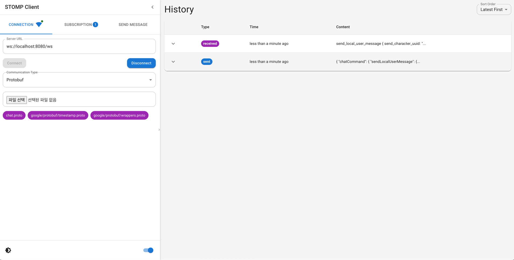

# STOMP Client

A feature-rich STOMP (Simple Text Oriented Messaging Protocol) client application built with Next.js and Material-UI, supporting both string and Protocol Buffers message formats.



## Features

- Real-time communication using STOMP over WebSocket
- Support for string and Protocol Buffers message formats
- Multiple destination subscription
- Publish messages to specific destinations
- Message history with sent and received messages
- Dark mode support
- Responsive design with collapsible sidebar

## Technologies Used

- Next.js
- React
- Material-UI
- @stomp/stompjs for STOMP communication
- protobufjs for Protocol Buffers support

## Getting Started

### Prerequisites

- Node.js (version 14 or later)
- npm or yarn

### Installation

1. Clone the repository:
   ```
   git clone https://github.com/waterfogSW/stomp-client.git
   ```

2. Navigate to the project directory:
   ```
   cd stomp-client
   ```

3. Install dependencies:
   ```
   npm install
   ```
   or if you're using yarn:
   ```
   yarn install
   ```

### Running the Application

1. Start the development server:
   ```
   npm run dev
   ```
   or with yarn:
   ```
   yarn dev
   ```

2. Open your browser and visit `http://localhost:3000`

## Usage

1. Enter the STOMP server URL in the "Server URL" field (e.g., ws://localhost:8080/ws).
2. Click "Connect" to establish a STOMP connection.
3. Choose between "String" or "Protobuf" message format.
4. If using Protobuf, upload your .proto file.
5. Enter a destination in the "Subscribe Destination" field and click "Add" to subscribe.
6. To send a message:
    - Enter the destination in the "Publish Destination" field.
    - Type your message in the "Message" field.
    - Click "Send Message" to publish.
7. View sent and received messages in the Message History table.

## STOMP Specifics

- This client uses STOMP 1.2 protocol.
- It supports connection headers for authentication if required by your STOMP server.
- The client can handle server-side heartbeats to maintain the connection.
